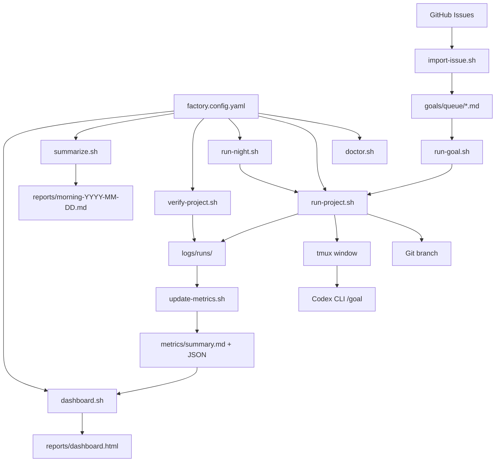

# Architecture

Software Factory is a local orchestration layer around Git, tmux, Codex CLI,
GitHub CLI, and project-specific goal files.

## System Flow



## Core Components

### Config

`factory.config.yaml` is the private local registry of projects. It defines
project paths, validation commands, branch prefixes, optional GitHub repos, and
agent roles.

Parsing lives in `scripts/lib/config.sh`. The project intentionally supports a
small documented YAML subset so the MVP stays inspectable.

### Goal Queue

Local goals live under `goals/queue/`. A goal contains metadata such as project,
priority, status, and role, plus the actual objective, scope, validation, stop
conditions, and delivery expectations.

### Run Logs

Every real run gets an ID like:

```txt
run-YYYY-MM-DD-HHMM
```

Run metadata and per-project status are written under:

```txt
logs/runs/<run-id>/
```

### tmux And Codex

`run-project.sh` creates a safe branch, opens a tmux window, starts Codex, and
prints or sends the `/goal` instruction depending on config.

### Verification

`verify-project.sh` runs configured validation commands and saves output to the
run log. Failures remain visible and block PR preparation.

### Metrics And Dashboard

`update-metrics.sh` turns run logs into Markdown and JSON. `dashboard.sh` turns
project config and recent run data into a local static dashboard.

## Safety Boundaries

- No automatic merging.
- No automatic deployment.
- No secret or credential editing.
- No destructive migrations.
- No overwriting dirty worktrees.
- No silent overwriting of existing branches, reports, logs, or tmux windows.
